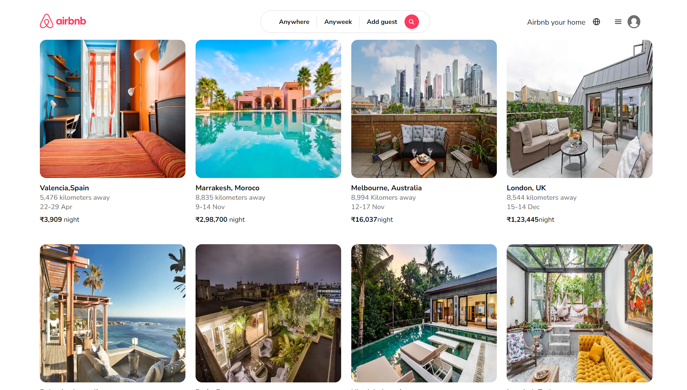

# Airbnb Clone - HTML & CSS

## Overview

This project is an Airbnb clone built using HTML and CSS. The goal is to recreate the basic layout and styling of the Airbnb website, providing a practical exercise for HTML and CSS enthusiasts to enhance their skills.



## Features

- Responsive design for various screen sizes.
- Home page layout with search functionality.
- Property listings with images and details.

## Demo

You can view a live demo of the project [here](https://yaseen-kc.github.io/airbnb-clone/).


## Getting Started

### Prerequisites

Make sure you have a modern web browser installed.

### Clone the Repository

```bash
git clone https://github.com/yaseen-kc/airbnb-clone
cd airbnb-clone
